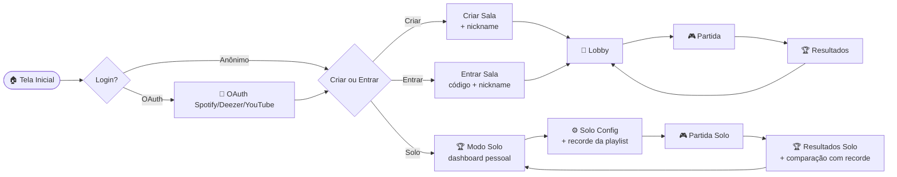

# Game Design Document — Mermã, a Música!

> **Versão canônica.** Substitui `archive/gdd_v1.1.md`. Esta é a fonte da verdade do produto.
>
> Conflitos entre este documento e outros (specs técnicas, ADRs) se resolvem aqui — **a regra do jogo é o que está no GDD**. Se o engine implementa diferente, o engine está errado.

## Índice

1. [Visão Geral](#1-visão-geral)
2. [Fluxo do Jogador](#2-fluxo-do-jogador)
3. [Mecânica de Rodada (Core Loop)](#3-mecânica-de-rodada-core-loop)
4. [Sistema de Pontuação](#4-sistema-de-pontuação)
5. [Seleção de Músicas](#5-seleção-de-músicas)
6. [Configuração da Partida (MatchConfiguration)](#6-configuração-da-partida-matchconfiguration)
7. [Modo Solo](#7-modo-solo)
8. [Estados Especiais](#8-estados-especiais-afk-host-migration-reconexão)
9. [Tela de Resultados](#9-tela-de-resultados-pós-partida)
10. [Áudio e Experiência Sonora](#10-áudio-e-experiência-sonora)
11. [Resumo de Decisões](#11-resumo-de-decisões)

---

## 1. Visão Geral

**Mermã, a Música!** é um quiz musical multiplayer online onde jogadores escutam trechos de músicas das playlists uns dos outros e tentam adivinhar nome da música, artista, ou ambos.

| Atributo | Valor |
|---|---|
| **Gênero** | Quiz musical multiplayer casual |
| **Plataforma** | Web (browser — desktop e mobile) |
| **Público-alvo** | Grupos de amigos, jogadores casuais, streamers, solo grinders. Ver [`02-personas.md`](02-personas.md). |
| **Idioma do MVP** | Português (Brasil) |
| **Sessão típica** | 5–15 min por partida (multiplayer); variável no solo |
| **Modelo de negócio** | Free, open-source |

Pilares de design e diferenciação em [`01-vision.md`](01-vision.md).

---

## 2. Fluxo do Jogador

### 2.1 Mapa de telas



### 2.2 Detalhe das telas

#### Tela Inicial

- Branding do jogo.
- Três botões principais: **"Criar Sala"**, **"Entrar na Sala"**, **"Jogar Sozinho"**.
- Botão secundário: **"Conectar conta"** (Spotify/Deezer/YouTube) — opcional.
- Se já tem `player_uuid` cookie + conta conectada anteriormente: estado é restaurado.

#### Login Opcional (OAuth)

- Não bloqueia o jogo. Anônimo é primeiro-classe.
- Conectar uma plataforma desbloqueia **importação de playlists**.
- Suportadas: Spotify, Deezer, YouTube Music.
- Após callback OAuth, retorna à tela onde estava.

#### Criar Sala

- Define `nickname` se ainda não definiu (input pré-preenchido se já existir cookie).
- Cria sala → recebe `invite_code` (6 chars, e.g., `ABC123`) + link copy-paste.
- Vira **host** automaticamente.
- Redireciona para o Lobby.

#### Entrar na Sala

- Input do `invite_code` (ou abre via link direto).
- Define `nickname` se ainda não definiu.
- Redireciona para o Lobby.

#### Lobby

- **Lista de jogadores** com status:
  - Avatar/inicial do nickname
  - Indicador `ready` ✅ ou `unready` ⭕ (host sempre ready, sem indicador)
  - Indicador `afk` 💤 (sobreposto, ortogonal a ready)
  - Indicador de plataforma conectada (Spotify/Deezer/YouTube/anônimo)
  - Indicador "tem playlist importada" 🎵
- **Importação de playlist** (se logado): seleciona uma playlist validada e marca para a partida.
- **Configuração da partida** (host only): controles para `time_per_round`, `total_songs`, `answer_type`, `allow_repeats`, `scoring_rule`. Em tempo real, broadcast para todos os jogadores.
- **Botão "Iniciar"** (host only): ativo sempre que ≥1 jogador na sala. Não requer todos ready.
- **Botão "Sair"**: leave voluntário.
- **Botão "AFK 💤 / Voltei"**: toggle de ausência.

#### Partida

Loop de rodadas — ver [§3](#3-mecânica-de-rodada-core-loop).

#### Resultados

Ver [§9](#9-tela-de-resultados-pós-partida).

#### Modo Solo

Ver [§7](#7-modo-solo).

---

## 3. Mecânica de Rodada (Core Loop)

### 3.1 Fluxo de uma rodada

```
1. Server seleciona música da rodada do pool
2. Server resolve audio (ISRC → Deezer); gera audio_token HMAC por jogador
3. Server emite round_starting; clients pedem áudio via GET /api/v1/audio/{token}
4. Grace period de 3 segundos (buffering do áudio)
5. timer_started (server é fonte da verdade)
6. Áudio toca no browser de cada jogador
7. Jogadores digitam resposta (podem alterar até o timer acabar)
8. Jogadores veem quem já respondeu (mas não o quê)
9. Timer acaba OU todos responderam + maioria votou skip
10. Revelação: música toca com nome/artista/álbum/dono + quem acertou/errou
11. 3s de pausa
12. Próxima rodada (ou fim da partida)
```

Diagrama detalhado em [`../20-architecture/04-sequence-diagrams.md#3-submit-answer--autocomplete--revelação`](../20-architecture/04-sequence-diagrams.md#3-submit-answer--autocomplete--revelação).

### 3.2 Input de resposta

- **Campo único** de texto livre com autocomplete opcional.
- **Autocomplete** vem do **pool total das playlists dos jogadores presentes** — não apenas da partida (evita spoiler de "essa música está na partida").
- Frontend aplica **debounce de 300ms**.
- Jogador pode selecionar uma sugestão ou enviar texto livre.
- **Jogador pode alterar a resposta** quantas vezes quiser até o timer acabar.
  - Para `SpeedBonus`, conta o tempo da **última** submissão.
  - Backend mantém apenas a última resposta de cada jogador.

### 3.3 Modos de resposta (`answer_type`)

O host escolhe antes de iniciar:

| Modo | O que o jogador precisa acertar | Notas |
|---|---|---|
| **`song`** | Nome da música | Mais difícil. |
| **`artist`** | Nome do artista | Médio. |
| **`both`** | Nome da música **OU** nome do artista | **Mais fácil** — qualquer um dos dois conta. Default. |

> Curiosidade comum: muita gente acha que `both` é o "modo difícil" porque pede "os dois". Na verdade é o oposto — qualquer um dos dois acerta. UI deve deixar isso claro.

### 3.4 Validação de respostas

Roda **sempre no backend** ([ADR-0007](../20-architecture/adrs/0007-fuzzy-match-levenshtein.md)). Frontend nunca sabe se acertou até `round_ended`.

Pipeline:

```
input_jogador
  ↓ normalize:
    - minúsculas
    - remove acentos
    - remove artigos (o, a, os, as, the, el, la)
    - remove conteúdo entre () e []
    - trim
  ↓
  ↓ fuzzy_match (Levenshtein):
    distância ≤ max(1, floor(len(target_normalizado) * 0.15))
  ↓
  ↓ resultado: match ou no match
```

#### Exemplos de match

| Resposta do jogador | Alvo | Resultado | Razão |
|---|---|---|---|
| `bohemian rhapsody` | Bohemian Rhapsody | ✅ | normalização (minúsculas) |
| `boemian rapsody` | Bohemian Rhapsody | ✅ | fuzzy (2 erros, threshold ~2) |
| `Evidencias` | Evidências | ✅ | normalização (acentos) |
| `Weekend` | The Weeknd | ✅ | normalização (artigo "the") + fuzzy |
| `musica aleatoria` | Bohemian Rhapsody | ❌ | distância grande demais |
| `(qualquer coisa)` | Bohemian Rhapsody | ❌ | conteúdo entre parênteses é removido na normalização — sobra string vazia, no match |

### 3.5 Pular rodada antecipadamente

A rodada encerra antes do timer se:

1. **Todos os jogadores já responderam** (resposta enviada, certa ou errada), E
2. **A maioria votou para pular** (botão "Pular" aparece após responder).

Maioria = `floor(N/2) + 1`. Para 4 jogadores: 3 votos. Para 5 jogadores: 3 votos. Para 1 jogador (solo): 1 voto (não aplicável — solo não tem skip).

### 3.6 Revelação (pós-rodada)

Quando a rodada encerra (timer ou skip):

- **A música continua tocando ou reinicia** durante a revelação.
- **Informações exibidas**: nome da música, artista, álbum, capa, **dono original** (player_uuid de quem importou).
- **Respostas reveladas**: o que cada jogador digitou + quem acertou (✅) / errou (❌) / não respondeu (—).
- **Pontos da rodada** mostrados.
- **Placar acumulado** atualizado.
- Após **3 segundos**, próxima rodada (ou `game_ended` se foi a última).

---

## 4. Sistema de Pontuação

### 4.1 Modo `simple`

- Acertou = **1 ponto**.
- Errou = **0 pontos**.
- Não respondeu = **0 pontos**.

Total final = total de acertos.

### 4.2 Modo `speed_bonus`

Fórmula:

```
pontos = max(100, 1000 - ((tempo_resposta / tempo_total_rodada) × 900))
```

Onde:
- `tempo_resposta` = segundos entre `timer_started` e a **última** `submit_answer`.
- `tempo_total_rodada` = `time_per_round` configurado (10–60s).
- Mínimo: **100 pontos** (respondeu no último segundo).
- Máximo: **1000 pontos** (respondeu instantaneamente).
- Errou = **0 pontos** (sem desconto, sem penalidade).
- Não respondeu = **0 pontos**.

#### Exemplo (rodada de 30s)

| Tempo de resposta | Pontos |
|---|---:|
| 0s (instantâneo) | 1.000 |
| 5s | 850 |
| 10s | 700 |
| 15s | 550 |
| 20s | 400 |
| 25s | 250 |
| 30s | 100 |

**Estratégia:** como o jogador pode alterar a resposta, vale chutar rápido e refinar se tiver tempo. Mas o **tempo da última submissão** é o que conta.

### 4.3 Desempate

Se 2+ jogadores empatam em pontuação final:

1. **Critério 1**: maior número de **acertos consecutivos** (streak máxima durante a partida).
2. **Critério 2**: empate aceito — múltiplos vencedores na mesma posição.

### 4.4 Modo Solo: usa `speed_bonus` por padrão

No solo, a pontuação **persiste como recorde pessoal** por (player_uuid, playlist_id). Ver [§7](#7-modo-solo).

---

## 5. Seleção de Músicas

### 5.1 Pool

Músicas vêm **exclusivamente** das playlists importadas pelos jogadores presentes na sala. Jogadores sem playlist não contribuem músicas — mas suas "cotas" são redistribuídas.

### 5.2 Range dinâmico de músicas por partida

Baseado no total de jogadores:

- **Mínimo**: 1 música por jogador (4 jogadores = mín. 4).
- **Máximo**: 5 músicas por jogador (4 jogadores = máx. 20).
- Jogadores sem playlist **contam para o range** (+1 mín, +5 máx).
- **Host escolhe** qualquer valor dentro do range.

| Jogadores | Com playlist | Sem playlist | Mín | Máx |
|---:|---:|---:|---:|---:|
| 1 (solo) | 1 | 0 | 1 | 5 |
| 4 | 4 | 0 | 4 | 20 |
| 4 | 2 | 2 | 4 | 20 |
| 10 | 7 | 3 | 10 | 50 |
| 20 | 15 | 5 | 20 | 100 |

### 5.3 Distribuição de músicas

Total escolhido pelo host é dividido **igualmente entre jogadores COM playlist**.

- Divisão **inexata**: round-robin entre jogadores em **ordem aleatória**. Os primeiros recebem 1 música extra.
- **Exemplo**: 13 músicas para 3 jogadores com playlist → 5, 4, 4.

### 5.4 Repetição (`allow_repeats`)

- **`false` (default)**: mesma música nunca aparece >1 vez na partida, mesmo se em múltiplas playlists. Comparação por **ISRC** quando disponível; fallback por `name + artist`.
- **`true`**: músicas podem aparecer várias vezes (se em playlists diferentes).

### 5.5 Donos de músicas podem responder suas próprias

Não há bloqueio — todos os jogadores respondem todas as rodadas, **mesmo as próprias músicas**.

### 5.6 Ordem das rodadas

**Aleatória**. Não alterna entre jogadores, não agrupa por playlist.

---

## 6. Configuração da Partida (MatchConfiguration)

Definida pelo host no Lobby, **antes de iniciar**.

| Configuração | Opções | Default |
|---|---|---|
| `time_per_round` | 10–60s (slider) | 30s |
| `total_songs` | Range dinâmico (§5.2) | Máximo do range |
| `answer_type` | `song` / `artist` / `both` | `both` |
| `allow_repeats` | `true` / `false` | `false` |
| `scoring_rule` | `simple` / `speed_bonus` | `speed_bonus` |
| `game_mode` | `multiplayer` / `solo` | `multiplayer` |

Mudanças no lobby são broadcast em tempo real via `config_updated`.

---

## 7. Modo Solo

> Modo de jogo explícito, **com regras e UI próprias** — não apenas multiplayer com 1 jogador. Foco em **progressão pessoal**: bater os próprios recordes.

### 7.1 Como entra

- Botão **"Jogar Sozinho"** na tela inicial.
- Ou: no Lobby multiplayer, se for único jogador, pode optar por "Iniciar como solo" (entra no flow do solo).

### 7.2 UI do dashboard solo (proposta)

Antes de iniciar, exibe:

```
┌───────────────────────────────────────────────────┐
│ 🏆 MERMÃ — MODO SOLO                              │
├───────────────────────────────────────────────────┤
│ Playlist: [▼ Anos 80 Brasil ▾]                    │
│                                                   │
│ 🎯 SEUS RECORDES NESTA PLAYLIST                   │
│ • Maior pontuação .... 9.450 pts (28/04)         │
│ • Maior streak ......... 8 acertos              │
│ • Tempo médio ......... 6.3s                     │
│ • Total de músicas conhecidas .. 47/120          │
│                                                   │
│ 📊 SEUS RECORDES GLOBAIS                          │
│ • Streak máximo de todos os tempos: 14            │
│ • Resposta mais rápida: 1.2s                      │
│ • Total de partidas solo: 23                      │
│                                                   │
│ ⚙️ CONFIGURAÇÃO                                   │
│ • Tempo por rodada: [30s ▼]                       │
│ • Total de músicas: [10 ▼]                        │
│ • Modo: [Música ou Artista ▼]                     │
│ • Permitir repetição: [Não ✓]                     │
│                                                   │
│         [INICIAR — Bate seu recorde!]             │
└───────────────────────────────────────────────────┘
```

> ASCII para registro de intenção. Mockups visuais reais ficam para UX (não no MVP — Vanilla TS/Solid + Tailwind).

### 7.3 Configurações escondidas no solo

`MatchConfiguration` no solo expõe **apenas o relevante**:

✅ Expostas:
- `time_per_round`
- `total_songs`
- `answer_type`
- `allow_repeats` (escolha livre do jogador)

❌ Escondidas/forçadas:
- `scoring_rule`: **forçado para `speed_bonus`** (faz sentido para competir consigo mesmo).
- `game_mode`: forçado para `solo`.
- Configurações multiplayer-only ocultas: voto-pular não existe, distribuição round-robin não se aplica.

### 7.4 Métricas pessoais persistidas

Em Postgres, tabela `solo_personal_best`:

| Chave | Valor |
|---|---|
| `(player_uuid, playlist_id, scoring_rule, time_per_round, answer_type)` | `max_score`, `max_streak`, `avg_response_time`, `songs_known_count`, `last_played_at` |

E métricas **globais** do jogador (independentes de playlist):

| Métrica | Detalhe |
|---|---|
| `solo_best_streak_ever` | Maior streak de qualquer partida solo |
| `solo_fastest_correct_ever` | Resposta correta mais rápida de qualquer partida |
| `solo_matches_played_total` | Total de partidas solo concluídas |
| `solo_songs_known_lifetime` | Distinct ISRC corretamente respondidos algum dia |

### 7.5 Prompt motivacional

- Antes de iniciar: **"Bata seu recorde de X.XXX pontos!"** (se há recorde para aquela playlist + config).
- Se não há recorde ainda: **"Primeira partida nessa playlist — qual será sua marca?"**
- Durante a rodada (se está perto de bater recorde): **"Bata o recorde — faltam X pontos!"** (subtle, não invasivo).
- Pós-partida: destaque visual se bateu recorde — **"🎉 NOVO RECORDE: 9.580 pts"** com indicador "+130 do anterior".

### 7.6 Compartilhamento

- Botão "Compartilhar" na tela de resultado solo: gera string de share text (ex: "Bati meu recorde no Mermã! 9.580 pts em 'Anos 80 Brasil'") com link da playlist usada (se pública).
- Geração de imagem para share: **fora do MVP** — entra no roadmap pós-MVP.

### 7.7 Diferenças mecânicas do solo vs multiplayer

| Aspecto | Multiplayer | Solo |
|---|---|---|
| Ranking | Comparativo entre jogadores | Comparativo consigo mesmo (histórico) |
| Voto-pular | Disponível após responder | Não existe |
| Distribuição de músicas | Round-robin entre playlists | Toda a partida sai de uma playlist única (a escolhida) |
| Espera de "ready" | N/A (host inicia) | N/A (1 jogador, inicia ao clicar) |
| Lobby | Lista de jogadores | Dashboard pessoal |
| Persistência do resultado | Postgres como histórico | Postgres como recorde pessoal |
| Destaques pós-partida | Streak, mais rápido, mais acertos | Comparação com recorde anterior |

---

## 8. Estados Especiais — AFK, Host Migration, Reconexão

### 8.1 AFK

- Flag `afk: boolean` por jogador (inclusive host).
- Marcação manual via botão "AFK 💤" no lobby ou durante partida.
- **Não muda regras** — partida continua, jogador continua podendo responder se voltar.
- Volta automaticamente a `false` em qualquer interação do jogador (clique em qualquer botão, digitar resposta, etc.).
- UI dos outros jogadores: badge visual "💤" sobre o avatar do jogador AFK.

### 8.2 Host migration

- Se host **desconecta** (cai ou sai voluntário):
  - Após **60 segundos** sem reconexão, papel migra para o **jogador conectado há mais tempo na sala**.
  - Evento `host_changed` é broadcast.
- Se host **reconecta dentro de 60s**: continua sendo host.
- Não há "passar o microfone" manual no MVP — só migração automática.

### 8.3 Reconexão durante partida

- Jogador perde Wi-Fi durante rodada:
  - Marcado como `Reconnecting` no roster (UI dos outros mostra "🟡 reconectando...").
  - **Suas respostas anteriores são preservadas.**
  - Janela de **2 minutos** para reconectar.
- Reconectar dentro da janela:
  - Server envia `room_state` fresco.
  - Cliente retoma. Se a rodada continua ativa, pode submeter nova resposta.
  - Se a rodada já encerrou e a partida segue, vê a revelação em catch-up.
- **Não reconectou em 2 min**: marcado como `left` com `reason: timeout`.

### 8.4 Recuperação após crash de servidor

(Diferente de reconexão de jogador — é o servidor caindo)

- Servidor reinicia → `RecoveryService` re-hidrata `RoomActor`s a partir de snapshots Redis ([ADR-0009](../20-architecture/adrs/0009-redis-snapshot.md)).
- Estado é restaurado com até 5s de atraso.
- Jogadores reconectam e retomam a partida.
- **UX do jogador**: percebem ~10-30s de "lag" durante o restart, mas a partida não é perdida.

---

## 9. Tela de Resultados (Pós-Partida)

### 9.1 Ranking final

Exibido imediatamente após a última rodada terminar:

- **Posição** de cada jogador (1º, 2º, 3º, ...).
- **Pontuação total**.
- **Destaque visual** para vencedor(es), incluindo empates.

### 9.2 Destaques (Highlights)

| Destaque | Descrição |
|---|---|
| **🔥 Maior streak** | Jogador com mais acertos consecutivos |
| **⚡ Resposta mais rápida** | Menor tempo de resposta correta da partida |
| **🎯 Conhecedor** | Jogador com mais acertos totais |
| **😬 Na trave** | Jogador com mais respostas quase certas (fuzzy próximo mas sem match) |

### 9.3 Retorno ao Lobby

- Após **5 segundos** na tela de resultados, retorno automático ao Lobby.
- Host pode reconfigurar e iniciar nova partida.
- Jogadores podem sair ou permanecer.

### 9.4 Resultado solo

Tela diferente: **comparação direta com recorde anterior**.

```
┌──────────────────────────────────────────┐
│ 🏆 NOVO RECORDE! 🎉                       │
│                                          │
│ 9.580 pts                                │
│ (+130 do recorde anterior: 9.450)        │
│                                          │
│ Streak máximo: 12 (recorde: 8) 🔥        │
│ Tempo médio: 5.8s (recorde: 6.3s) ⚡     │
│ Músicas conhecidas: 8/10                 │
│                                          │
│  [JOGAR DE NOVO]  [COMPARTILHAR]         │
└──────────────────────────────────────────┘
```

Se **não** bateu recorde: tom é encorajador, sem castigo.

```
┌──────────────────────────────────────────┐
│ Partida concluída                        │
│                                          │
│ 8.230 pts                                │
│ (recorde: 9.450 — faltaram 1.220)       │
│                                          │
│ Streak: 7 (recorde: 12)                 │
│                                          │
│  [TENTAR DE NOVO]  [TROCAR PLAYLIST]     │
└──────────────────────────────────────────┘
```

---

## 10. Áudio e Experiência Sonora

### 10.1 Fonte

- Audio engine universal via **Deezer** ([ADR-0004](../20-architecture/adrs/0004-audio-deezer-as-engine.md)).
- Previews de 30 segundos da API pública Deezer.
- Resolução por **ISRC** (preferencial) ou fallback nome+artista.
- Fallback para **Spotify Web Playback SDK** quando música não existe no Deezer (raro, requer Premium do dono).

### 10.2 Duração do áudio

- Toca pelo tempo configurado (10–60s).
- Preview Deezer é fixo de 30s — se `time_per_round > 30s`, áudio termina antes do timer; jogador tem tempo restante em silêncio para responder.

### 10.3 Revelação (áudio pós-rodada)

- Música **continua tocando ou reinicia** durante os 3s de revelação.
- Cria o momento "ahh, era essa!" — central para diversão social ([§1 — Diversão social](#1-diversão-social) em [`01-vision.md`](01-vision.md)).

### 10.4 Música indisponível

- Preview quebrado / expirado / não encontrado:
  - Backend **pula automaticamente** e seleciona outra do pool de reserva.
  - Se sem reservas: rodada é pulada e `total_rounds` diminui em 1.
  - **Jogadores não percebem** — UX flui sem interrupção.

### 10.5 Anti-cheat

Resumo das mitigações para evitar burla via inspeção/scripts/MITM:

- **`audio_token` HMAC** vinculado a `player_uuid` + `round_id` + `expiry` — outro jogador não usa o token do colega.
- **TLS obrigatório** (Caddy força HTTPS) — mitiga MITM.
- **Headers ID3 e `Content-Length` strippados** no proxy — sem identificação por inspeção de rede.
- **Sem `Range: bytes=` parcial** — rejeitado pelo proxy.
- **Rate limit** por (`player_uuid`, `round_id`): 1 request por rodada.
- Detalhes técnicos em [`../30-specs/02-audio.md`](../30-specs/02-audio.md) (F5) e [`../40-operations/03-security-anticheat.md`](../40-operations/03-security-anticheat.md) (F6).

---

## 11. Resumo de Decisões

| Decisão | Escolha |
|---|---|
| Mecanismo de resposta | Texto livre + autocomplete opcional |
| Fonte do autocomplete | Pool total das playlists da sala |
| Validação | Fuzzy (Levenshtein in-house) + normalização |
| Modo `both` | Campo único, aceita música OU artista — modo **mais fácil** |
| Pontuação `simple` | 1 ponto/acerto, 0 erro |
| Pontuação `speed_bonus` | 1000 (instantâneo) a 100 (último segundo), linear |
| Resposta errada | 0 pontos, sem punição |
| Não respondeu | 0 pontos, conta como erro |
| Alterar resposta | Permitido até timer; tempo da **última** submissão conta |
| Visibilidade durante rodada | Todos veem quem respondeu, não o quê |
| Pular rodada | Todos responderam + maioria votou |
| Revelação pós-rodada | Música segue + nome/artista/álbum/dono + respostas |
| Tempo entre rodadas | 3s |
| Resultados → Lobby | Automático em 5s |
| Dono da música pode responder | Sim |
| Desempate | Maior streak; senão empate aceito |
| Repetição | `allow_repeats=false` impede mesma música por ISRC |
| Range músicas | 1–5 por jogador (dinâmico) |
| Redistribuição sem playlist | Round-robin entre quem tem playlist |
| Modo Solo | **Modo explícito** com UI/regras próprias |
| Host sempre ready | Sim |
| Pode iniciar com unready | Sim (host decide) |
| AFK | Flag social, não muda regras |
| Reconexão | Janela 2min, retoma estado |
| Crash do server | Recovery automático via snapshot Redis |
| Recorde solo persistido | Por (player, playlist, config) + globais |

---

## Changelog

- **2026-05-13:** versão canônica consolidada. Substitui `archive/gdd_v1.1.md`. Adições principais: §7 (Modo Solo expandido), §8 (estados especiais — AFK, host migration, recovery), §9.4 (resultado solo), ASCII mockups do dashboard solo. Regras revisadas: host sempre ready; host pode iniciar com qualquer número de jogadores.
