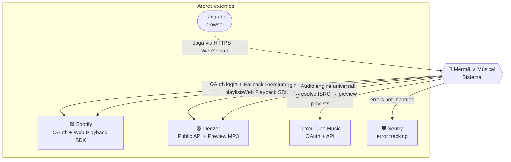
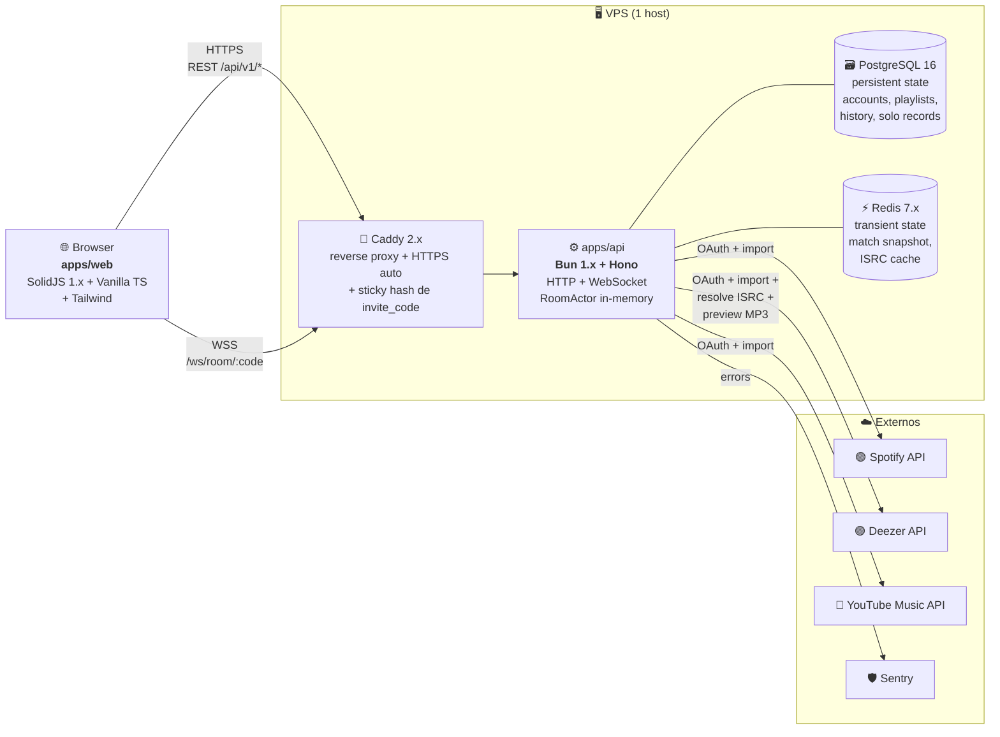

# Arquitetura — Níveis 1 e 2 (C4)

Documento que descreve o sistema em duas resoluções:

- **Nível 1 — System Context:** o que é o sistema, com quem fala. Para conversas com não-engenheiros.
- **Nível 2 — Containers:** quais processos rodam, em que linguagem, falando que protocolo. Para conversas técnicas iniciais.

Detalhes internos (componentes dentro de cada container) ficam em [`02-bounded-contexts.md`](02-bounded-contexts.md) e nas specs em [`30-specs/`](../30-specs/).

---

## Nível 1 — System Context

### Atores

| Ator | Papel |
|---|---|
| **Jogador** | Humano com browser (desktop ou mobile). Cria/entra em salas, importa playlists, joga rodadas, vê ranking. Pode estar **anônimo** (sem conta) ou **logado** via OAuth de uma das plataformas. |
| **Spotify** | OAuth provider para login + importação de playlists. **Engine de áudio alternativa** (Web Playback SDK, fallback Premium). |
| **Deezer** | OAuth provider para login + importação de playlists. **Engine de áudio principal** — todos os previews tocam daqui via API pública (sem auth) com resolução por ISRC. |
| **YouTube Music** | OAuth provider para login + importação de playlists. **Não fornece áudio**; músicas importadas são resolvidas no Deezer via ISRC ou nome+artista. |
| **Sentry** | Captura erros não-tratados da API. Free tier. SDK no Bun. |

### Por que o sistema existe

Permitir que pessoas joguem um **quiz musical multiplayer em tempo real**, usando **suas próprias playlists** como conteúdo. Diferencial: cada partida tem um pool único formado pela coleção dos jogadores presentes.

### Limites do sistema

- **Mermã** é dono: identidade interna (`player_uuid`), salas, partidas, validação de respostas, proxy de áudio, recordes (solo).
- **Mermã não é dono:** catálogo musical (vem das plataformas), conta de música (vem das plataformas), pagamento (não há — jogo free).

---

## Nível 2 — Containers (estado inicial — 1 VPS)

Visão "como rodamos em produção hoje". Topologia futura (N VPS) está em [`05-deployment.md`](05-deployment.md).

### Inventário de containers

| Container | Tech | Papel | Stateful? | ADRs relevantes |
|---|---|---|---|---|
| **Browser (`apps/web`)** | SolidJS 1.x + Vanilla TS + Tailwind, bundle ~25KB | SPA do jogador. Mantém estado de UI via signals; comunica com API via REST + WS. | Sim (in-memory + localStorage de `player_uuid`) | [0008](adrs/0008-frontend-solidjs.md) |
| **Caddy 2.x** | Caddy nativo | Reverse proxy. Termina TLS (Let's Encrypt auto). Faz sticky routing por hash de `invite_code` quando houver N≥2 nodes de API. | Não | [0002](adrs/0002-server-hono.md) |
| **API (`apps/api`)** | Bun 1.x + Hono + TS 6.0 | Servidor HTTP + WebSocket. Detém `RoomActor` em memória (single-writer-per-room). Roteia REST. Faz proxy de áudio. Gerencia OAuth. | **Sim, autoritativo** (estado vivo da partida) | [0001](adrs/0001-runtime-bun-and-ts-6.md), [0002](adrs/0002-server-hono.md), [0004](adrs/0004-audio-deezer-as-engine.md) |
| **PostgreSQL 16** | Postgres + Drizzle ORM | Persistência durável: contas conectadas, playlists importadas (normalizadas), histórico de partidas, recordes pessoais do modo solo. | Sim | [0006](adrs/0006-postgres-drizzle.md) |
| **Redis 7.x** | Redis com `appendonly` | Estado transiente: snapshot de partida ativa (TTL 30min), cache ISRC→Deezer (TTL 24h). | Sim, mas transiente | [0009](adrs/0009-redis-snapshot.md) |
| **Sentry (SaaS)** | Sentry free tier | Captura erros não-tratados. Fora do hot path. | — (externo) | [0010](adrs/0010-observability-minimal.md) |

### Comunicação entre containers

| De → Para | Protocolo | Detalhes |
|---|---|---|
| Browser → Caddy | HTTPS / WSS | TLS terminado em Caddy. Cookies (`__Host-session` se logado, `player_uuid`). |
| Caddy → API | HTTP / WS interno | Loopback (mesma VPS no MVP). Hash de `invite_code` para routing futuro. |
| API ↔ Postgres | TCP (Postgres protocol) | Pool com max=10 conexões. |
| API ↔ Redis | TCP (RESP3) | Cliente `bun:redis` (preferência) ou `ioredis`. Bind localhost; senha obrigatória. |
| API → Spotify/Deezer/YouTube | HTTPS | Outbound somente. Throttle interno (Deezer 50req/5s). |
| API → Sentry | HTTPS | Outbound. Apenas em erros. |

### Fluxo de uma rodada (alto nível — detalhes em [`04-sequence-diagrams.md`](04-sequence-diagrams.md))

1. Browser conecta WSS em `wss://merma.exemplo/ws/room/ABC123` com `player_uuid` no header/query.
2. Caddy roteia para o node Bun via sticky hash.
3. API encontra o `RoomActor` correspondente (ou cria se não existir).
4. RoomActor gerencia o ciclo da rodada — emite eventos via WS para todos os jogadores conectados naquela sala.
5. Para cada nova rodada, RoomActor resolve a música (ISRC cache → Deezer), gera `audio_token` HMAC, e emite `round_starting`.
6. Cada browser pede `GET /api/v1/audio/{token}` e recebe o stream proxied (sem headers ID3, sem `Content-Length` original).
7. Snapshots em Redis a cada 5s; em recovery, RoomActor re-hidrata.

---

## O que NÃO está aqui (nível 3 — Components)

Diagrama de componentes internos do `apps/api` (e.g.: `RoomRegistry`, `RoomActor`, `WsGateway`, `AuthService`, `AudioProxy`, `Repositories`) vive em [`02-bounded-contexts.md`](02-bounded-contexts.md). Detalhamento implementacional (estruturas de dados, contratos exatos) em [`30-specs/`](../30-specs/).

## Changelog

- **2026-05-13:** primeira versão consolidada. Reflete a stack pós-pivot (Bun + Hono + Solid + Postgres + Redis + Caddy), sem resquícios de BEAM/Phoenix/Gleam/SvelteKit.
