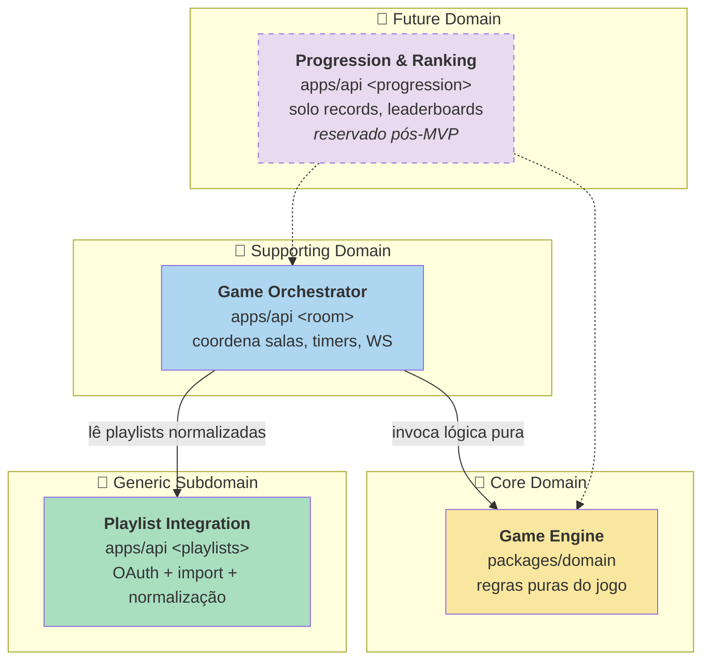

# Bounded Contexts (DDD)

> Bounded Context é uma fronteira explícita dentro da qual um modelo é consistente. Termos definidos aqui significam **uma única coisa** nesse contexto; o mesmo termo pode significar algo diferente em outro contexto, com sua própria definição.
>
> Linguagem ubíqua compartilhada em [`../glossary.md`](../glossary.md). Quando um termo aparecer aqui, **a definição é a do glossary** — este documento não duplica.

## Mapa de contextos

Mermã tem **4 bounded contexts** — três ativos no MVP e um reservado para futuro:



| Domínio | Tipo | Pacote/Local | Status |
|---|---|---|---|
| 🧠 Game Engine | Core | `packages/domain` | Ativo |
| 🔧 Game Orchestrator | Supporting | `apps/api` (módulos de sala) | Ativo |
| 🔌 Playlist Integration | Generic | `apps/api` (módulos de playlists) | Ativo |
| 🔮 Progression & Ranking | Future | `apps/api` (namespace reservado) | Pós-MVP |

---

## 1. 🧠 Game Engine — Core Domain

`packages/domain` — Lógica **pura** do jogo. Sem I/O, sem dependências externas (exceto `@merma/schema` para tipos). 100% testável com `bun test`.

### Agregados e entidades

- **`Match` (Aggregate Root)** — uma execução completa do jogo: estado (`waiting` | `in_match` | `finished`), configuração, lista de rodadas, placar acumulado, identidade do host.
- **`Round` (Entity)** — uma rodada dentro da partida: música escolhida, momento de início/fim do timer, respostas coletadas, vencedores.
- **`PlayerInMatch` (Entity)** — estado do jogador dentro da partida: score, streak corrente, lista de rodadas respondidas, ready/AFK.
- **`Song` (Value Object)** — referência canônica de uma música: ISRC, nome, artista, álbum, dono original (player_uuid de quem importou).
- **`MatchConfiguration` (Value Object)** — config imutável: time_per_round, total_songs, answer_type, allow_repeats, scoring_rule, game_mode.
- **`Answer` (Value Object)** — texto digitado pelo jogador + resultado normalizado da validação.

### Funções principais (puras)

```typescript
type Result<T, E> = { ok: true; value: T } | { ok: false; error: E };

// Criar e configurar partida (validação de config + roster)
configureMatch(currentMatch, config): Result<Match, ConfigError>

// Iniciar partida (transição waiting → in_match)
startMatch(match, now): Result<Match, NotEnoughPlayersError | NoPoolError>

// Aceitar/atualizar resposta de um jogador
submitAnswer(match, playerUuid, answerText, now): Result<Match, RoundClosedError | NotInMatchError>

// Avaliar resposta (fuzzy match)
evaluateAnswer(answerText, song, answerType): Result<EvaluationResult, never>

// Calcular pontos de uma rodada (Simple ou SpeedBonus)
calculatePoints(scoringRule, answer, roundConfig): number

// Encerrar rodada (timer expirou OU maioria votou skip)
endRound(match, reason, now): Result<Match, NotInRoundError>

// Encerrar partida (após última rodada)
endMatch(match, now): Result<MatchResult, NotInMatchError>
```

### Invariantes (regras de ouro)

- **Resposta vazia** ≡ não respondeu ≡ 0 pontos.
- **Respostas só são aceitas** com `Round` em estado `timer_running`.
- **Tempo de resposta nunca > tempo total da rodada** (clamping defensivo).
- **Mesma `Song` aparece no máximo uma vez por partida** quando `allow_repeats = false`, identificada por ISRC.
- **Host é sempre `ready`** (não pode ser marcado como `unready`).
- **`game_mode: solo`** ignora regras de multiplayer (sem voto-pular, sem distribuição round-robin de músicas, sem ranking comparativo).

### Linguagem ubíqua deste contexto

Definida em [`../glossary.md`](../glossary.md): `Match`, `Round`, `Song`, `Streak`, `Pool`, `Revelação`, `Grace period`, `answer_type`, `scoring_rule`, `Modo Solo`.

---

## 2. 🔧 Game Orchestrator — Supporting Domain

`apps/api` em módulos relacionados a sala (`routes/ws.ts`, `services/RoomActor.ts`, `services/RoomRegistry.ts`).

Coordena o ciclo de vida das salas e partidas no servidor: aceita comandos via WebSocket, despacha para a engine (Core), persiste estado vivo em memória, faz snapshot transiente em Redis, persiste resultado final no Postgres.

### Componentes principais

- **`RoomRegistry`** — Map global `invite_code → RoomActor`. Resolve qual node hospeda qual sala (em ambiente N≥2). No node atual, contém todas as salas ativas dele.
- **`RoomActor`** — *single-writer-per-room*. Detém o estado de **uma** sala. Toda mutação passa por uma fila assíncrona (queue interna), garantindo zero condições de corrida internas.
- **`WsGateway`** — recebe `submit_answer`, `player_ready`, etc., e despacha para o `RoomActor` correto.
- **`Timer`** — sub-componente do `RoomActor` que dispara `round_ended` quando o timer expira.
- **`SnapshotWriter`** — serializa o estado do `RoomActor` em Redis a cada 5s (apenas durante `in_match`/`reveal`).
- **`RecoveryService`** — ao subir, varre Redis por snapshots sem `RoomActor` vivo e re-hidrata.

### Comandos aceitos (do client via WS)

`player_ready`, `player_unready`, `player_afk_changed`, `configure_match`, `start_game`, `submit_answer`, `vote_skip`, `select_playlist`, `player_leave`, `autocomplete_search`.

Detalhes de contrato em [`../30-specs/04-websocket.yaml`](../30-specs/04-websocket.yaml) (F5).

### Eventos emitidos (para o client via WS)

`room_state`, `player_joined`, `player_left`, `player_ready_changed`, `player_afk_changed`, `config_updated`, `host_changed`, `game_starting`, `round_starting`, `timer_started`, `answer_confirmed`, `player_voted_skip`, `round_ended`, `game_ended`, `autocomplete_results`, `error`.

### Linguagem ubíqua deste contexto

`Room`, `Host`, `Lobby`, `Ready`, `AFK`, `Invite code`, `Grace period`. **Compartilha** `Match`/`Round` com Game Engine (mesmo VO).

### Regras críticas

- **Host migration:** se host desconecta e não reconecta em 60 segundos, papel migra para o jogador conectado há mais tempo. Evento: `host_changed`.
- **Player timeout:** jogador desconectado por >2 minutos é considerado `left` com `reason: timeout`.
- **Reconexão:** ao reconectar dentro de 2 min, server envia `room_state` fresco e o jogador retoma onde parou.
- **Persistência do resultado:** ao chegar em `game_ended`, RoomActor faz **uma escrita final** em Postgres (histórico) e deleta o snapshot Redis.

---

## 3. 🔌 Playlist Integration — Generic Subdomain

`apps/api` em módulos `routes/auth.ts`, `routes/playlists.ts`, `services/PlaylistImporter.ts`, `services/AudioResolver.ts`.

Abstrai as plataformas externas (Spotify, Deezer, YouTube Music) atrás de **interfaces internas** estáveis. Lida com:

1. **OAuth flow** das 3 plataformas (login, callback, refresh proativo de token).
2. **Importação de playlists** — paginate, normaliza para `NormalizedSong` (estrutura comum independente da origem).
3. **Resolução de áudio** — dado um `NormalizedSong`, encontra o preview Deezer correspondente (ISRC → fallback nome+artista). Cache ISRC→Deezer em Redis (24h TTL).
4. **Proxy de áudio** — handler `GET /api/v1/audio/{audio_token}` que baixa do Deezer, strippa metadados, retorna stream sanitizado ao client.

### Entidades

- **`ConnectedAccount`** — vínculo entre `player_uuid` e uma plataforma externa via OAuth (token de refresh armazenado encrypted at rest — política em [`../40-operations/02-privacy-lgpd.md`](../40-operations/02-privacy-lgpd.md)).
- **`ImportedPlaylist`** — playlist importada e normalizada, pronta para uso na partida. Persistida em Postgres.
- **`NormalizedSong`** — estrutura padrão: `{ isrc?, name, artist, album?, owner_player_uuid, source_platform }`.

### Anti-corruption layer

Cada plataforma tem seu próprio módulo client (`SpotifyClient`, `DeezerClient`, `YouTubeMusicClient`) que **converte para `NormalizedSong`**. O resto do sistema **nunca** vê estruturas raw das plataformas.

### Linguagem ubíqua deste contexto

`ConnectedAccount`, `ImportedPlaylist`, `NormalizedSong`, `ISRC`, `Preview`, `Audio engine`, `audio_token`.

### Trade-offs e limites

- Plataformas mudam APIs sem aviso. Cada client é **isolado** — quebra de uma não derruba o resto.
- Throttling Deezer (50req/5s) implementado via **token bucket interno** durante importação de playlists grandes.
- Importação de playlist com 1.000 músicas é **assíncrona** (background job dentro do processo Bun) — não bloqueia o handler HTTP.

---

## 4. 🔮 Progression & Ranking — Future Domain

`apps/api/progression/` — **reservado**, não implementado no MVP.

Cobre:
- Recordes pessoais do **Modo Solo** (já decidido como entrega do MVP segundo o [`glossary.md`](../glossary.md) e o futuro [`10-product/03-gdd.md`](../10-product/03-gdd.md)). Subset mínimo implementado em MVP: `solo_personal_best` por (`player_uuid`, `playlist_id`) com pontuação e data.
- Estatísticas globais (XP, nível, conquistas) — **fora do MVP**.
- Leaderboards globais — **fora do MVP**.

### Decisão de design

Namespace reservado em `apps/api/progression/` desde já. Modelo do banco para `solo_personal_best` entra no MVP; o resto fica como **placeholder + ADR futuro** quando começar a desenvolver.

### Por que separar agora

DDD recomenda **identificar contextos cedo** mesmo se não implementados. Quando chegar a hora, sabemos onde mora, qual é a fronteira, e como conversa com o resto.

---

## Regras de dependência entre contextos

```
                                ┌──────────────────┐
                                │  packages/schema │  (Zod contracts compartilhados)
                                └────────┬─────────┘
                                         │
                ┌────────────────────────┼────────────────────────────┐
                │                        │                            │
                ▼                        ▼                            ▼
  ┌──────────────────────┐  ┌──────────────────────┐  ┌─────────────────────────────┐
  │  Game Engine         │  │  Playlist Integration│  │ Progression & Ranking       │
  │  (packages/domain)   │  │  (apps/api/playlists)│  │ (apps/api/progression)      │
  │  Core, puro          │  │  Generic, I/O        │  │ Future                      │
  └──────────┬───────────┘  └──────────┬───────────┘  └──────────┬──────────────────┘
             ▲                         │                         ▲
             │                         │                         │
             └─────────────┬───────────┴─────────────────────────┘
                           │
                ┌──────────────────────┐
                │  Game Orchestrator   │
                │  (apps/api/room)     │
                │  Supporting          │
                └──────────────────────┘
```

### Permitido

- `Game Orchestrator` invoca **funções puras** de `Game Engine` (uma direção apenas).
- `Game Orchestrator` lê `NormalizedSong` de `Playlist Integration`.
- `Progression` lerá `Match` de `Game Orchestrator` para registrar resultados (futuro).
- Todos dependem de `packages/schema` para contratos Zod.

### Proibido

- `Game Engine` **não** importa de `Game Orchestrator`, `Playlist Integration` ou `Progression`. Engine é puro.
- `Playlist Integration` **não** importa de `Game Engine` ou `Game Orchestrator`. É generic — não conhece partidas.
- `apps/web` (cliente) **não** importa de `packages/domain` diretamente — toda lógica do jogo vive no server. UI apenas reflete eventos do servidor.

Convenção validada em revisão de PR. Lint rule (eslint `no-restricted-imports`) entra na config quando o repo estiver popular ([ADR-0005](adrs/0005-monorepo-bun-workspaces.md)).

---

## Changelog

- **2026-05-13:** primeira versão consolidada. Reescrita a partir de `archive/DOMAIN_MODELS_v0_gleam.md`, agora em TypeScript com `packages/domain` puro, `apps/api` orquestrador. Sem Gleam/BEAM/GenServer.
