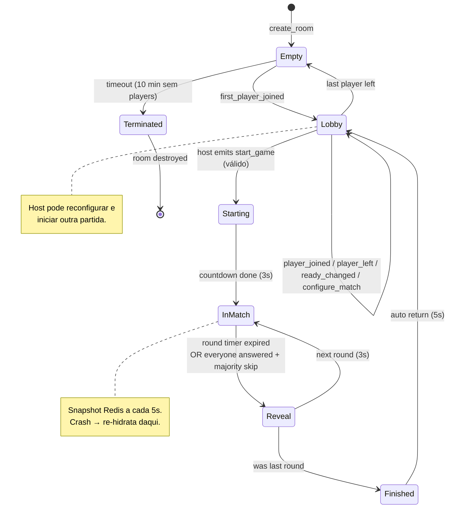
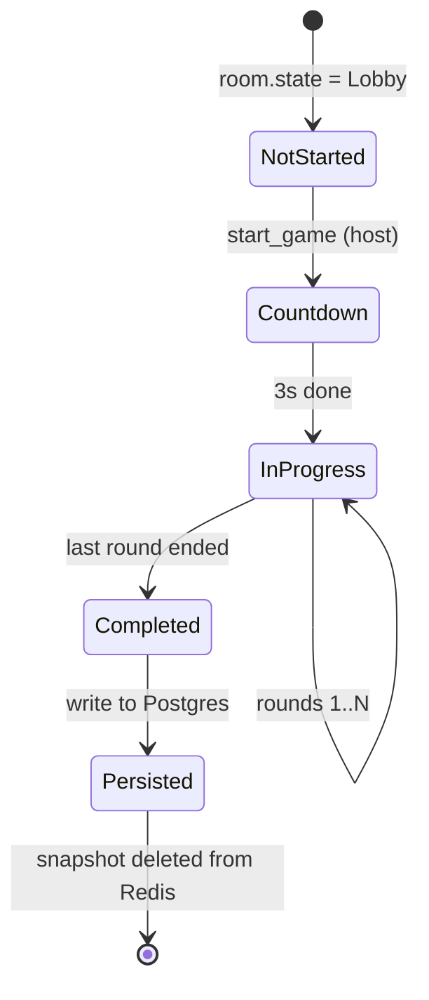
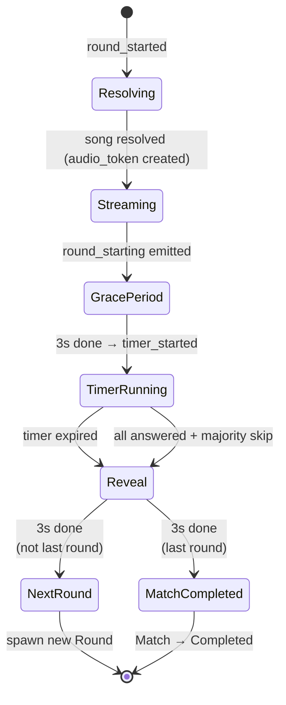
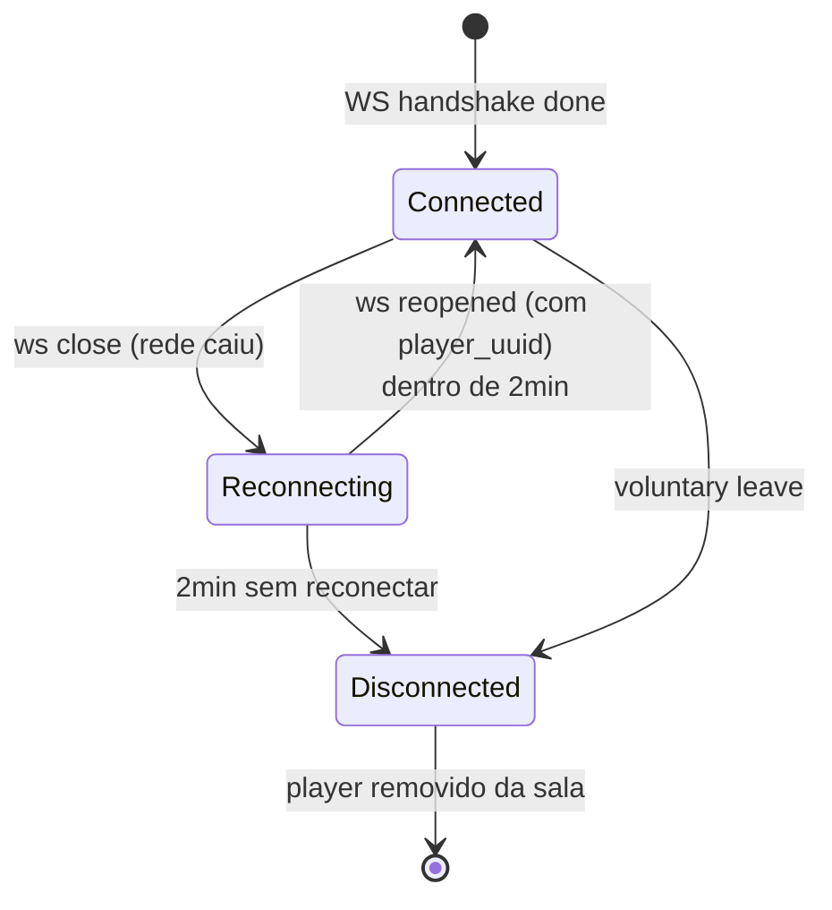
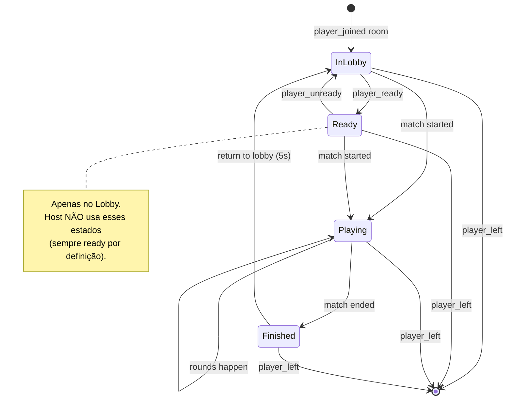

# State Machines

Diagramas formais de estado para as **5 entidades temporais** do sistema:

1. `Room` — sala (existe entre criação e expiração).
2. `Match` — partida (vida curta dentro da sala).
3. `Round` — rodada (vida muito curta dentro da partida).
4. `Player connection` — estado da conexão WS de um jogador.
5. `Player in match` — papel do jogador dentro da partida em andamento.

Cada máquina lista **estados**, **transições legais** (com gatilhos) e **comportamento em estados terminais** (timeout, crash, recovery).

Estados não documentados aqui são **proibidos**. Tentativa de transição ilegal retorna `Result<_, IllegalStateError>` e é logada.

---

## 1. `Room`

A sala persiste entre partidas. Mesmo após `game_ended`, jogadores podem permanecer e iniciar nova partida.

### Estados

| Estado | Significado | Quem está? |
|---|---|---|
| `Empty` | Sala criada (ou esvaziou) mas sem jogadores conectados. Tem TTL: 10 min sem `first_player_joined` → terminada. | — |
| `Lobby` | ≥1 jogador na sala, aguardando partida iniciar. | 1..20 jogadores |
| `Starting` | Host clicou em iniciar; countdown de 3s antes de `InMatch`. | 1..20 jogadores |
| `InMatch` | Partida em andamento, rodada ativa (timer rodando). | 1..20 jogadores |
| `Reveal` | Pós-rodada: música revelada, respostas mostradas, pontos atribuídos. Dura ~3s. | 1..20 jogadores |
| `Finished` | Última rodada terminou; ranking final exibido. Dura 5s antes de voltar ao Lobby. | 1..20 jogadores |
| `Terminated` | Sala expirou (10 min vazia) ou foi forçadamente destruída. RoomActor removido da memória. Snapshot Redis deletado. | — |

### Invariantes

- Não existe transição direta de `Lobby` para `InMatch`; sempre passa por `Starting`.
- Não existe transição de `InMatch` direta para `Lobby` — partida termina sempre por `Finished` (mesmo se for abandonada por todos saírem; ver "casos especiais" abaixo).
- `Terminated` é absorvente. Não há "ressuscitar" — gerar nova sala com mesmo `invite_code` é proibido por 30 min após `Terminated` (cooldown que evita ambiguidade em links compartilhados).

### Casos especiais

- **Todos saem durante `InMatch`:** Match imediatamente vai para `Finished` (com `final_scores` vazio), e em seguida `Lobby` → `Empty`. RoomActor permanece vivo por 10 min até `Terminated`.
- **Host sai sem retorno em 60s:** transição emitida `host_changed`; jogador conectado há mais tempo vira host. Sala continua no mesmo estado.

---

## 2. `Match`

Existe **apenas durante** `Room.state ∈ {Starting, InMatch, Reveal, Finished}`. Não persiste em Postgres até `game_ended`.

### Estados

| Estado | Detalhe |
|---|---|
| `NotStarted` | Configuração sendo definida pelo host. |
| `Countdown` | 3 segundos antes da primeira rodada. |
| `InProgress` | Rodadas executando (1..N). |
| `Completed` | Última rodada terminou; ranking calculado. |
| `Persisted` | Resultado escrito em Postgres; snapshot Redis deletado. |

### Persistência

- **Estado vivo:** memória do `RoomActor` + snapshot Redis a cada 5s.
- **Persistência final:** ao entrar em `Persisted`, **uma única escrita** em Postgres com:
  - `match_id`, `room_id`, `started_at`, `ended_at`, `config`
  - tabela filha `match_player_score` com placar de cada jogador
  - tabela filha `match_round` com cada rodada e suas respostas (anonimizadas se LGPD requer)
- **Snapshot Redis é deletado** ao concluir `Persisted` (não esperamos TTL).

---

## 3. `Round`

Vive dentro de `Match.state = InProgress`.

### Estados

| Estado | Duração | O que acontece |
|---|---|---|
| `Resolving` | <500ms | RoomActor escolhe próxima música do pool, resolve ISRC→Deezer (cache hit é instantâneo; miss faz 1 chamada Deezer). |
| `Streaming` | breve | `audio_token` HMAC gerado; cache de preview MP3 baixado se cache miss. |
| `GracePeriod` | 3s exatos | `round_starting` emitido; clients pedem áudio e buffereiam. |
| `TimerRunning` | 10–60s (config do host) | Áudio toca; jogadores respondem (podem alterar até timer acabar). |
| `Reveal` | 3s exatos | Música revelada, pontos atribuídos, respostas visíveis. |

### Invariantes

- **Tempo de resposta** é medido em relação a `TimerRunning.start`, não a `Streaming` ou `GracePeriod`.
- **Resposta enviada durante `GracePeriod` ou `Reveal`** → `error: round_not_accepting_answers`.
- **Music indisponível** (Deezer 404) durante `Resolving` → pula esta música, escolhe próxima do pool de reserva. Se pool esgotar → reduz `total_rounds` em 1 e segue.

---

## 4. `Player connection`

Estado da conexão WebSocket de um jogador, independente do estado da partida.

### Estados

| Estado | Significado | UI dos outros jogadores |
|---|---|---|
| `Connected` | WS aberto e ativo. | Sem badge especial. |
| `Reconnecting` | WS fechou (rede instável); janela de 2 min. | Badge "🟡 reconectando..." |
| `Disconnected` | Saiu voluntariamente OU timeout de 2 min sem reconexão. | Player some da lista. |

### Comportamento em rodada

- **`Connected` durante `TimerRunning`:** comportamento normal.
- **`Reconnecting` durante `TimerRunning`:** server **mantém** suas respostas (não invalida); ao reconectar dentro da janela, server envia `room_state` fresco e o cliente retoma. Rodada continua para os outros.
- **`Disconnected` durante `TimerRunning`:** se já tinha resposta, mantém; se não, conta como "não respondeu" (0 pontos).
- **Host em `Disconnected` por >60s:** host migration (ver seção `Room`).

### AFK (ortogonal)

`afk: boolean` é **flag separada**, não estado. Pode ser `true` em qualquer estado `Connected`. Em `Reconnecting`/`Disconnected` é automaticamente irrelevante (UI já mostra outro indicador).

---

## 5. `Player in match`

Papel funcional do jogador dentro de uma partida ativa.

### Estados

| Estado | Detalhe |
|---|---|
| `InLobby` | Está na sala mas não marcou ready. |
| `Ready` | Marcado como pronto para a próxima partida. Apenas no Lobby. |
| `Playing` | Partida em andamento (qualquer fase). |
| `Finished` | Partida concluída; viu o ranking. |

### Host

Host **não** transita por `Ready` — é sempre considerado ready. Comandos `player_ready`/`player_unready` emitidos pelo host retornam `error: host_is_always_ready`.

---

## Casos críticos de recovery

### Crash do node Bun durante `InMatch`

1. Processo morre. WebSockets dos jogadores conectados caem (eles entram em `Reconnecting`).
2. `RoomActor` perdido.
3. Reboot/restart do processo. `RecoveryService` varre Redis e encontra snapshot da sala.
4. `RoomActor` recriado em memória, **restaurado para o estado salvo (até 5s atrasado)**.
5. Jogadores reconectam com `player_uuid`; server envia `room_state` fresco.
6. **Se reboot demorar >2 min:** jogadores foram marcados como `Disconnected` no estado salvo; ao reconectar, ainda recebem `room_state` (estado válido) e podem continuar (treat como reconexão tardia bem-sucedida).

### Deploy rolling (N≥2 nodes)

1. Node A: drain ativado — não aceita **novas** salas.
2. Salas existentes em A continuam até `Match.Persisted`.
3. Quando A esvazia → desligado.
4. Versão nova sobe → próximas salas pousam nela.
5. Zero impacto em partidas em andamento.

### Deploy hard-cut (1 VPS, MVP)

1. Anúncio em janela de baixo uso (e.g., 04h BRT).
2. Salas ativas no momento são **interrompidas**.
3. Recovery automático: ao restart, snapshots Redis recriam `RoomActor`s.
4. Jogadores que reconectarem em 2 min retomam onde pararam.
5. Jogadores que nunca reconectarem viram `Disconnected`.

---

## Mapeamento estado → eventos WS emitidos

Resumo de qual evento é emitido em cada transição (consultar [`../30-specs/04-websocket.yaml`](../30-specs/04-websocket.yaml) para payloads exatos).

| Transição | Evento WS |
|---|---|
| `Room.Empty → Lobby` (alguém entrou) | `player_joined`, `room_state` ao novo jogador |
| `Room.Lobby → Starting` | `game_starting { countdown_seconds: 3 }` |
| `Room.Starting → InMatch` | (silencioso — `round_starting` da rodada 1 marca o início) |
| `Round.* → Streaming → GracePeriod` | `round_starting { audio_token, grace_period_seconds: 3 }` |
| `Round.GracePeriod → TimerRunning` | `timer_started { duration_seconds }` |
| `submit_answer` durante `TimerRunning` | `answer_confirmed` ao emissor |
| `Round.TimerRunning → Reveal` | `round_ended { song, answers, scores }` |
| `Match.InProgress → Completed → Persisted` | `game_ended { final_scores, ranking, highlights }` |
| `Player.Connected → Reconnecting` | `player_left` (com pequeno delay para evitar flicker em desconexões brevíssimas) — **a refinar nas specs WS** |
| Host saiu por >60s | `host_changed { new_host_uuid, new_host_nickname }` |

---

## Changelog

- **2026-05-13:** primeira versão consolidada. Cobre Room/Match/Round/Player connection/Player in match. Cobre recovery via Redis snapshot. Cobre AFK como flag ortogonal a estado.
