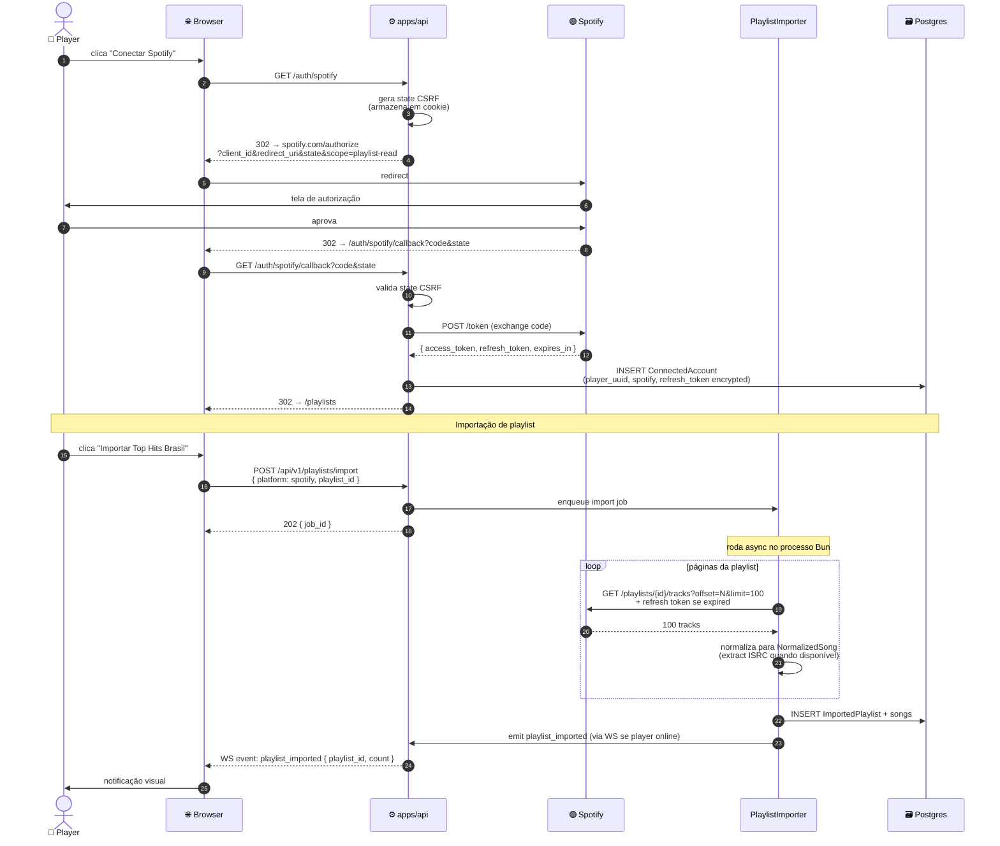

# Sequence Diagrams — Fluxos Críticos

Diagramas de sequência dos **fluxos de runtime mais importantes**. Servem para alinhar entendimento entre quem escreve frontend, backend, e quem revisa.

Para contratos exatos de payloads, ver [`../30-specs/04-websocket.yaml`](../30-specs/04-websocket.yaml) (F5).

## Fluxos cobertos

1. **Criar sala + entrar** — primeiro contato do jogador.
2. **Iniciar partida** — host clica em iniciar, rodada começa.
3. **Submit answer + autocomplete + reveal** — coração da rodada.
4. **Recovery após crash** — descrito em prosa (não diagrama).
5. **OAuth flow** — login + importação de playlist.

---

## 1. Criar sala + entrar

```mermaid
sequenceDiagram
    autonumber
    actor Player as 👤 Jogador
    participant Browser as 🌐 Browser (apps/web)
    participant Caddy as 🚦 Caddy
    participant API as ⚙️ apps/api
    participant Reg as RoomRegistry
    participant Actor as RoomActor (novo)
    participant PG as 🗃️ Postgres

    Player->>Browser: clica "Criar sala"
    Browser->>Browser: gera player_uuid (se não existe)<br/>persiste em cookie
    Browser->>+Caddy: POST /api/v1/rooms<br/>{ nickname }
    Caddy->>+API: forward
    API->>Reg: createRoom(host=player_uuid)
    Reg->>Reg: gera invite_code único (6 chars)
    Reg->>Actor: spawn(invite_code, host_uuid)
    Actor->>Actor: state = Empty
    API-->>-Caddy: 201 { invite_code, room_id }
    Caddy-->>-Browser: 201
    Browser->>Browser: navega para /room/ABC123
    Browser->>+Caddy: WS upgrade<br/>wss://.../ws/room/ABC123<br/>?player_uuid=...&nickname=...
    Caddy->>+API: WS upgrade (hash invite_code → mesmo node)
    API->>Reg: getRoom(ABC123)
    Reg-->>API: actor
    API->>Actor: playerJoin(player_uuid, nickname)
    Actor->>Actor: state Empty → Lobby<br/>add player to roster
    Actor->>API: emit room_state (full)
    API-->>Browser: room_state
    Note over Actor: snapshot writer<br/>NÃO ativo ainda<br/>(state = Lobby)

    rect rgba(255, 230, 200, 0.2)
        Note over Player,Actor: Outro jogador entra
        Player->>Browser: cola invite_code em outro device
        Browser->>+Caddy: GET /room/ABC123 (página)
        Caddy-->>-Browser: SPA carrega
        Browser->>+Caddy: WS upgrade .../ws/room/ABC123
        Caddy->>+API: WS (mesmo node, sticky hash)
        API->>Actor: playerJoin(player_uuid_2, nickname_2)
        Actor->>API: broadcast player_joined { player }
        API-->>Browser: player_joined (para player 1)
        API-->>Browser: room_state (para player 2)
    end
```

### Pontos críticos

- **`player_uuid` é gerado no browser**, não no server. Cookie `Max-Age=1 ano`.
- **`invite_code` é único** — gerado no `RoomRegistry` com retry se colisão.
- **Sticky routing** garante que ambos os jogadores caem no mesmo node, no mesmo `RoomActor`.
- **`room_state` completo** é enviado a cada nova entrada (não diffs no MVP).

---

## 2. Iniciar partida + rodada começa

```mermaid
sequenceDiagram
    autonumber
    participant Host as 👤 Host
    participant P2 as 👤 Player 2
    participant API as ⚙️ apps/api
    participant Actor as RoomActor
    participant Engine as packages/domain
    participant Audio as AudioResolver
    participant Deezer as 🟣 Deezer
    participant Redis as ⚡ Redis

    Host->>API: WS send: start_game
    API->>Actor: dispatch(start_game, host_uuid)
    Actor->>Engine: startMatch(match, now)
    Engine-->>Actor: Result.ok(match with state=Countdown)
    Actor-->>Host: broadcast game_starting { countdown: 3 }
    Actor-->>P2: broadcast game_starting { countdown: 3 }

    Note over Actor: setTimeout 3s

    Actor->>Actor: state → InMatch (round 1)
    Actor->>Audio: resolveNext(roomPool, allowRepeats)
    Audio->>Audio: cache hit? (ISRC → Deezer ID)
    alt Cache miss
        Audio->>Deezer: GET /track?isrc=...
        Deezer-->>Audio: deezer_track + preview_url
        Audio->>Redis: SET isrc:{X}:deezer (TTL 24h)
    end
    Audio->>Deezer: fetch preview MP3
    Deezer-->>Audio: binary
    Audio->>Audio: cache MP3 in-memory<br/>(TTL = round duration)
    Audio->>Audio: gera audio_token<br/>HMAC(secret, player_uuid || round_id || expiry)
    Audio-->>Actor: { audio_token, audio_source: deezer }

    par broadcast for each player
        Actor-->>Host: round_starting<br/>{ round=1, audio_token_host, grace=3 }
        Actor-->>P2: round_starting<br/>{ round=1, audio_token_p2, grace=3 }
    end

    Note over Host,P2: cada player tem<br/>seu próprio audio_token (HMAC)

    par each player fetches audio
        Host->>API: GET /api/v1/audio/{token_host}
        API->>API: verify HMAC + single-use + TTL
        API-->>Host: stream MP3 (headers strippados)
        P2->>API: GET /api/v1/audio/{token_p2}
        API->>API: verify HMAC + single-use + TTL
        API-->>P2: stream MP3 (headers strippados)
    end

    Note over Actor: setTimeout 3s (grace period)

    Actor->>Actor: timer started
    Actor->>Redis: SNAPSHOT (state=InMatch)
    Actor-->>Host: timer_started { duration: 30 }
    Actor-->>P2: timer_started { duration: 30 }

    loop a cada 5s
        Actor->>Redis: SNAPSHOT
    end
```

### Pontos críticos

- **Áudio é resolvido apenas uma vez** por rodada (cache em memória do RoomActor; reusado por todos do lobby).
- **Cada jogador recebe seu próprio `audio_token`** HMAC — impede compartilhamento externo da URL.
- **Snapshot Redis começa quando `state = InMatch`**, e não antes.
- **Grace period de 3s** dá tempo para todos buffereiarem antes do timer real começar.

---

## 3. Submit answer + autocomplete + revelação

```mermaid
sequenceDiagram
    autonumber
    participant Player as 👤 Player
    participant Browser as 🌐 Browser
    participant API as ⚙️ apps/api
    participant Actor as RoomActor
    participant Engine as packages/domain

    Note over Player,Engine: Cenário: jogador digita "bohem"

    Player->>Browser: tecla "b"-"o"-"h"-"e"-"m"
    Browser->>Browser: debounce 300ms
    Browser->>API: WS send: autocomplete_search { query: "bohem" }
    API->>Actor: dispatch(autocomplete_search)
    Actor->>Actor: busca no pool (substring + case-insensitive)<br/>max 10 results
    Actor-->>Browser: autocomplete_results { query, results: [...] }
    Browser->>Player: mostra sugestões

    Player->>Browser: clica em "Bohemian Rhapsody"<br/>OU termina digitando
    Browser->>API: WS send: submit_answer { answer_text: "Bohemian Rhapsody" }
    API->>Actor: dispatch(submit_answer, player_uuid, "Bohemian Rhapsody", now)
    Actor->>Engine: submitAnswer(match, player_uuid, text, now)
    Engine->>Engine: registra answer (substituindo anterior se houver)
    Engine-->>Actor: Result.ok(match updated)
    Actor-->>Browser: answer_confirmed { player_uuid }
    Note over Actor,Browser: NÃO revela se acertou.<br/>Cliente apenas vê "confirmado".

    rect rgba(200, 230, 255, 0.2)
        Note over Player,Actor: Player muda de ideia
        Player->>Browser: digita "Don't Stop Me Now"
        Browser->>API: WS send: submit_answer { answer_text: "Don't Stop Me Now" }
        API->>Actor: dispatch
        Actor->>Engine: submitAnswer (substitui anterior)
        Engine-->>Actor: Result.ok
        Actor-->>Browser: answer_confirmed
        Note over Engine: SpeedBonus usa tempo<br/>desta ÚLTIMA submissão
    end

    Note over Actor: timer expira (30s done)

    Actor->>Engine: endRound(match, reason: timer, now)
    Engine->>Engine: avalia respostas (fuzzy + normalize)<br/>calcula pontos por scoring_rule<br/>atualiza streak de cada player
    Engine-->>Actor: Result.ok(match with round ended)
    Actor-->>Browser: round_ended<br/>{ song, answers: [all], scores: {...} }
    Note over Browser: UI mostra: música revelada,<br/>quem acertou, pontos,<br/>placar atualizado.

    Note over Actor: setTimeout 3s
    Actor->>Actor: next round (volta ao fluxo de Iniciar partida)
```

### Pontos críticos

- **Autocomplete** é resolvido pelo server (não pelo client) — protege contra inspeção do pool.
- **`submit_answer` é idempotente:** mesma mensagem com mesmo texto não cria entrada duplicada; texto diferente substitui o anterior.
- **`answer_confirmed` não revela acerto/erro.** Revelação só em `round_ended`.
- **Fuzzy match acontece ao final da rodada** (não a cada submit) — mais eficiente e atômico.
- **`round_ended` é broadcast para todos**, com `answers` de **todos** (incluindo `answer_text`).

---

## 4. Recovery após crash (prosa)

Cenário: VPS reinicia durante uma partida ativa de 20 jogadores no `RoomActor` ABC123.

1. **T₀**: processo morre. WebSockets caem. Snapshot Redis tem estado de `T₀ - até 5s`.
2. **T₀ + ~10s**: processo Bun renasce. `RecoveryService` varre `room:*:snapshot` em Redis.
3. **T₀ + ~10s**: encontra `room:ABC123:snapshot`. Re-hidrata `RoomActor` com aquele estado. Marca todos os jogadores como `Reconnecting`.
4. **T₀ + ~10s**: snapshot writer reativa para a sala.
5. **T₀ + 10s..130s**: jogadores tentam reconectar.
6. **Para cada reconexão:**
   - Browser tenta WS com `player_uuid` no query string.
   - Sticky routing leva ao mesmo node (hash de invite_code).
   - `RoomActor` reconhece o `player_uuid` no roster. Marca como `Connected`.
   - Envia `room_state` fresco.
7. **Em `T₀ + 130s`:** jogadores que não reconectaram são marcados `Disconnected` (timeout 2 min).
8. Se sala ainda tem ≥1 jogador conectado, partida continua de onde parou.
9. **Perda potencial:** até 5s do timer da rodada corrente (intervalo do último snapshot). Aceitável; documentado como NFR em [`../40-operations/01-nfrs.md`](../40-operations/01-nfrs.md) (F6).

---

## 5. OAuth flow + importação de playlist



### Pontos críticos

- **State CSRF** em cookie HttpOnly + Secure protege o callback.
- **Refresh token** é armazenado encrypted at rest (política em [`../40-operations/02-privacy-lgpd.md`](../40-operations/02-privacy-lgpd.md), F6).
- **Importação é assíncrona** — não bloqueia o handler HTTP. Usa **token bucket interno** para respeitar rate limit Spotify (varies).
- **Notificação ao concluir** via WS se o player estiver online; senão fica disponível na próxima abertura.

---

## O que NÃO está aqui

- **Modo Solo:** flow específico (sem multiplayer) virá no GDD em [`../10-product/03-gdd.md`](../10-product/03-gdd.md) (F3).
- **Vote skip:** flow simples — disponível só após `submit_answer`; quando maioria vota, `endRound` é chamado antes do timer. Detalhe em [`../30-specs/04-websocket.yaml`](../30-specs/04-websocket.yaml) (F5).
- **Host migration:** descrito em prosa em [`03-state-machines.md`](03-state-machines.md) §1; sem diagrama dedicado.

---

## Changelog

- **2026-05-13:** primeira versão. 5 fluxos críticos cobertos.
