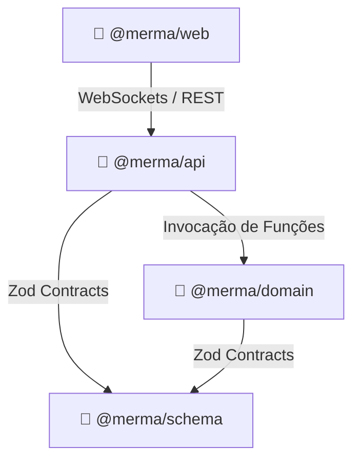

# 📘 Mermã, a Música! — Blueprint Técnico & de Domínio

> **Versão 2.1 — MVP | Maio 2026**
> Este é o documento mestre do projeto, consolidando a visão estratégica, design de domínio (DDD) e a nova infraestrutura baseada em **Vanilla TypeScript 6.0**.

---

## 1. 🎯 Visão Estratégica

**"Mermã, a Música!"** é um quiz musical multiplayer online focado em personalização e competitividade social. O diferencial reside na capacidade de cada jogador importar suas próprias playlists (Spotify, Deezer, YouTube Music), criando um pool de músicas único a cada partida.

### 1.1 Core Fantasy
"Provar que você conhece mais música que seus amigos usando as playlists de todo mundo."

---

## 2. 🗺️ Mapa de Contexto (Context Map)

O projeto é dividido em **Bounded Contexts** isolados via **Monorepo (Bun Workspaces)**.

### 2.1 Bounded Contexts

1.  **🧠 @merma/domain**: Lógica pura do jogo (rodadas, pontos, validação fuzzy). Escrito em **Vanilla TS 6.0** puro, sem dependências externas.
2.  **🔌 @merma/api**: Backend (Hono + Bun). Gerencia salas, conexões e persistência.
3.  **🎨 @merma/web**: Frontend Vanilla TS. Interface ultra-leve focada em performance.
4.  **📜 @merma/schema**: Contratos Zod compartilhados para garantir type-safety ponta-a-ponta.

---

## 3. 🛠️ Stack Tecnológica & Leis de Dependência

Este projeto segue a **Lei de Dependências do Mermã**:

1.  **Prioridade Nativa**: Sempre usar APIs integradas do Bun (`Bun.serve`, `Bun.password`, `Bun.sqlite`, etc.) antes de buscar pacotes externos.
2.  **Zero node_modules**: Não mantemos a pasta `node_modules` no projeto. O Bun resolve dependências on-the-fly via **Auto-install** e cache global (`~/.bun/install/cache`).
3.  **NPM do Bun**: Só usamos pacotes do NPM que o Bun consiga gerenciar nativamente via auto-install.
4.  **Internal First**: Se uma funcionalidade complexa não existir no ecossistema Bun/NPM com a qualidade exigida, ela **DEVE** ser criada como um pacote interno em `packages/`.

| Camada | Tecnologia | Justificativa |
| :--- | :--- | :--- |
| **Runtime** | **Bun 1.x** | Engine de execução, Testes, Bundler e Auto-installer. |
| **Lógica** | **Vanilla TS 6.0** | Rigor técnico com `Result Type` e `Branded Types`. |
| **Web Server** | **Hono** | Interface ultra-leve para HTTP e WebSockets. |
| **Database** | **Postgres + Drizzle** | Type-safe SQL com o menor overhead possível. |

---

## 4. 🧠 Padrões de Domínio (TS 6.0 Rigor)

Para garantir que o código seja uma referência de consulta, adotamos:

- **Result Pattern**: Erros são valores (`ok: true | false`). Nada de `throw/catch`.
- **Branded Types**: Segurança nominal para IDs (ex: `UserId` não é compatível com `RoomId`).
- **Functional Domain Modeling**: O domínio é composto por funções puras e tipos imutáveis.

---

## 5. 🎵 Sistema de Áudio & Anti-Cheat

O sistema de áudio utiliza um **Audio Proxy** para proteger a integridade do jogo.
1. **Proxy Universal**: O backend consome o áudio da fonte (Deezer) e repassa ao frontend via stream sanitizado.
2. **Metadata Stripping**: Headers ID3 e metadados de stream são removidos para impedir identificação por ferramentas de inspeção de rede.
3. **ISRC Resolution**: Normalização de músicas entre Spotify, YouTube e Deezer usando códigos ISRC.

---

## 6. 🎨 Arquitetura Frontend (MVVM Vanilla)

Frontend focado em performance absoluta:
- **Zero Framework**: Sem React, Vue ou Svelte. Manipulação de DOM direta e eficiente.
- **ViewModels**: Gerenciam o estado da UI e se comunicam com os Repositories.
- **Reactive Primitives**: Uso de observables simples para atualização de UI.
